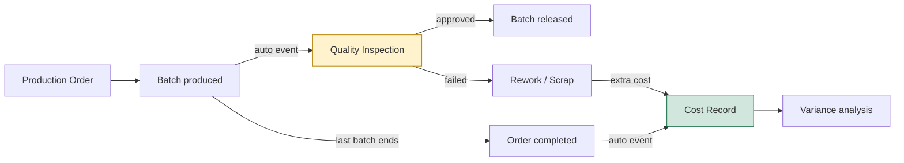
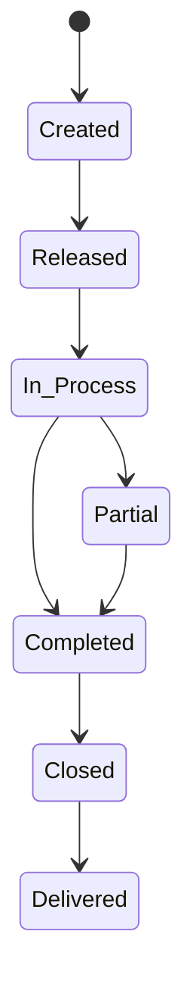
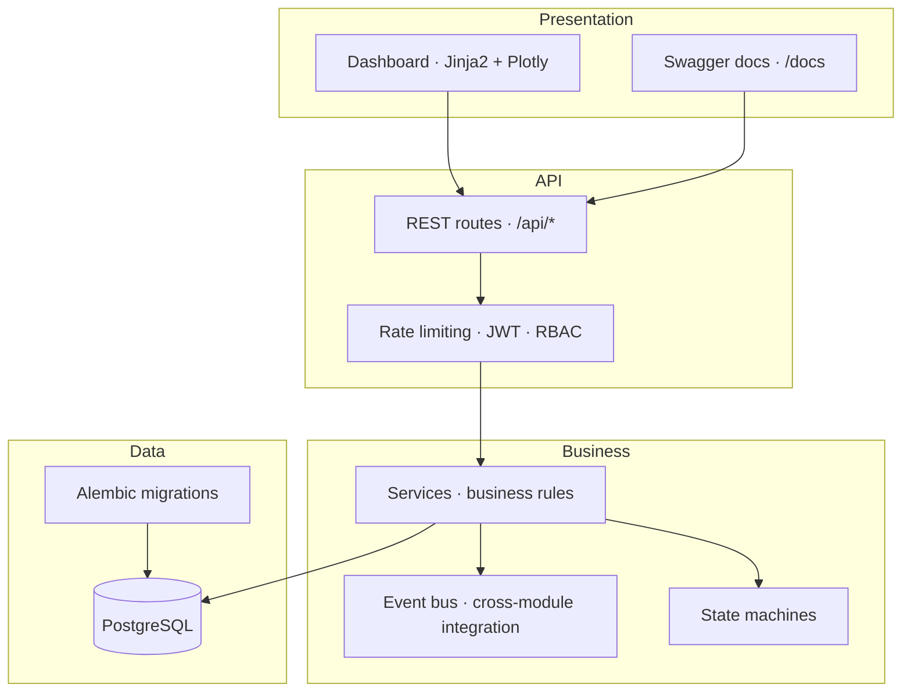
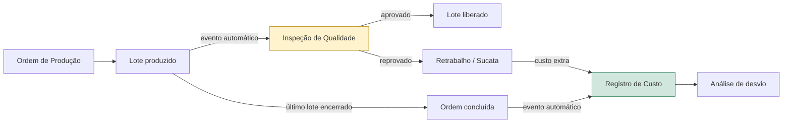
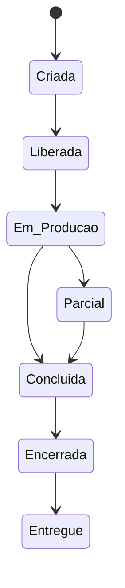
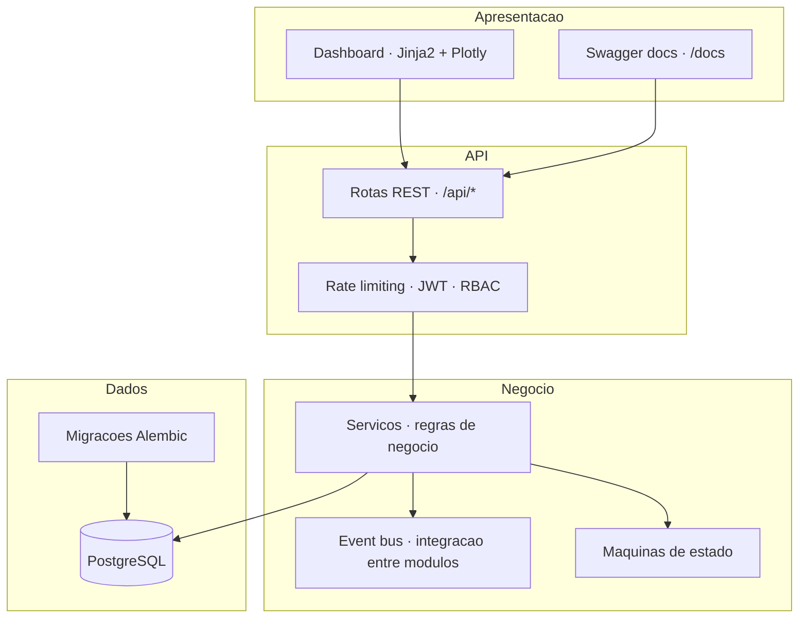

# Industrial ERP Simulator

**Integrated PP-PI, QM & CO Process Simulation** — *inspired by SAP S/4HANA concepts.*

> **Disclaimer:** This project is *not* an SAP implementation. It is inspired by
> SAP concepts (PP-PI, QM, CO) for educational and demonstration purposes. All
> industrial data is **synthetic** — for educational and simulation purposes only.

---

<details open>
<summary>🇧🇷 <b>Leia em Português</b></summary>

<details>
<summary>🌐 <b>Read in English</b> (Clique para expandir / Click to expand)</summary>

---

# Industrial ERP Simulator

**Integrated PP-PI, QM & CO Process Simulation** — *inspired by SAP S/4HANA concepts.*

> **Disclaimer:** this project is *not* an SAP implementation. It is inspired by
> SAP concepts (PP-PI, QM, CO) for educational and demonstration purposes. All
> industrial data is **synthetic** — for educational and simulation purposes only.

---

## What is this project? (in plain words)

An ERP is the "operating system" of a company — the software that runs its
production, controls its quality and tracks its money. Large enterprises use
systems like SAP for this. This project builds, from scratch, a **miniature
version of that world** and simulates a whole year of plant operations with
synthetic data.

It simulates the journey of a product from start to finish, showing how three
areas of a company depend on each other:

| Module | What it does | Everyday equivalent |
|--------|--------------|---------------------|
| **PP-PI** (Production) | Plans and executes production: recipes (BOM + routing), production orders, batches, machines/resources | "What do we make, how, and with what?" |
| **QM** (Quality) | Inspects every batch produced and decides: approved, rework or scrap | "Is this batch good enough to ship?" |
| **CO** (Costing) | Computes planned vs. actual cost of each order and the variance | "Did we make money or lose money?" |

## Why this project stands out

This is **not a generic CRUD / to-do list**. It is a domain-rich, full-stack
system with real engineering problems. Highlights at a glance:

- **Real business domain.** It models rules that actually exist in industry
  (SAP-inspired PP-PI / QM / CO). It shows you don't just "write code" — you
  understand business.
- **Modules that talk to each other automatically.** When a batch is produced,
  the system *itself* creates a quality inspection; when production finishes,
  it *itself* creates the cost record; a failed inspection *itself* adds rework
  cost. This is done with an event-driven design — no module depends directly
  on another.
- **Business rules that cannot be skipped.** The system has "state machines"
  that forbid illegal flows (e.g. you cannot close an order that was never
  completed). Rules live in one place and the whole app obeys them.
- **Security with roles.** JWT authentication, three access levels
  (admin / operator / viewer), rate limiting and account lockout.
- **Serious about quality.** ~9,500 lines of code with unit + integration
  tests, static validation and Alembic database migrations.
- **Documentation as a habit.** Architecture, business process, data model,
  runbook, audits and planning documents — decisions are explained, not
  assumed.
- **Production deployment experience.** Docker, a production-ready compose
  file, reverse proxy + Cloudflare notes, environment handling and security
  hardening.
- **Full-stack.** Python (FastAPI) backend + React / TypeScript frontend +
  analytical dashboard (Jinja2 + Plotly).

## How the modules talk to each other (diagram)

The heart of the project: one action in Production automatically triggers the
next step in Quality, which can change the final cost. This chain is what turns
three separate "features" into an **integrated system**.



## Business rules enforced by state machines (diagram)

The system forbids invalid status changes. A production order can only follow
this path — trying to "jump" is rejected by the API:



## Architecture (diagram)

Layers are separated so business rules do not depend on the framework or the
database — a design you can grow and maintain:



## Features

- **REST API** (FastAPI) with JWT auth + role-based access (admin / operator / viewer)
- **State machines** enforcing valid transitions for production orders and quality inspections
- **Event-driven integration** — creating a batch auto-triggers a quality inspection; completing an order auto-creates a cost record
- **Simulation engine** generating months of synthetic data (normal and crisis scenarios)
- **Dashboard** (Jinja2 + Plotly.js) with executive KPIs, monthly trend and Order 360° view
- **Rate limiting**, account lockout, and SQLAlchemy/Alembic migrations

## Technology stack

| Technology | Use |
|-----------|-----|
| Python 3.11 | Core language |
| FastAPI | API framework |
| SQLAlchemy 2.0 | ORM |
| Pydantic v2 | Data validation |
| PostgreSQL | Database |
| Alembic | Migrations |
| Jinja2 + Plotly.js | Dashboard |
| PyJWT | Authentication |
| React + TypeScript + Vite | Web frontend (hono) |

## API — Swagger documentation

The full API is self-documented and interactive. Start the project and open
**`http://localhost:8000/docs`** (Swagger UI) to test every endpoint live.

### Auth `/api/auth`

| Method | Route | Description |
|--------|-------|-------------|
| POST | `/api/auth/register` | Create a user account |
| POST | `/api/auth/login` | Login and receive a JWT token |
| GET | `/api/auth/me` | Get the current logged-in user |

### Production `/api/production`

| Method | Route | Description |
|--------|-------|-------------|
| GET / POST | `/materials` | List / create materials |
| GET / PUT / DELETE | `/materials/{id}` | Get, update or delete a material |
| GET / POST | `/recipes` | List / create recipes (BOM + routing) |
| GET / PUT / DELETE | `/recipes/{id}` | Get, update or delete a recipe |
| GET | `/recipes/code/{code}` | Find recipe by code |
| GET | `/recipes/material/{material_id}` | Recipes for a material |
| GET / POST | `/orders` | List / create production orders |
| GET | `/orders/{id}` | Get an order |
| GET | `/orders/number/{order_number}` | Find order by number |
| GET | `/orders/status/{status}` | Orders by status |
| PUT | `/orders/{id}/status` | Advance order status (validated) |
| GET | `/batches/order/{order_id}` | Batches of an order |
| GET | `/batches/number/{batch_number}` | Find batch by number |
| POST | `/batches` | Create a batch (auto-triggers inspection) |
| PATCH | `/batches/{batch_id}/status` | Change batch status (validated) |
| GET | `/batches/{batch_id}/confirmations` | Production confirmations of a batch |
| GET | `/batches/{batch_id}/consumptions` | Material consumptions of a batch |
| POST | `/confirmations` | Register a production confirmation |
| POST | `/consumptions` | Register a material consumption |
| GET / POST | `/resources` | List / create resources |
| GET | `/resources/{id}` | Get a resource |
| GET | `/resources/code/{code}` | Find resource by code |
| GET | `/resources/work-center/{work_center}` | Resources by work center |

### Quality `/api/quality`

| Method | Route | Description |
|--------|-------|-------------|
| GET / POST | `/inspections` | List / create quality inspections |
| GET | `/inspections/{id}` | Get an inspection |
| GET | `/inspections/lot/{inspection_lot}` | Find inspection by lot number |
| GET | `/inspections/batch/{batch_id}` | Inspections of a batch |
| PUT | `/inspections/{id}/result` | Register result (approved / failed) |
| GET / POST | `/inspections/{id}/non-conformities` | List / add non-conformities |

### Costing `/api/costing`

| Method | Route | Description |
|--------|-------|-------------|
| GET / POST | `/records` | List / create cost records |
| GET | `/records/{id}` | Get a cost record |
| GET | `/records/order/{order_id}` | Cost record of an order |
| PUT | `/records/{id}/actual` | Update actual (real) costs |
| GET | `/records/{id}/summary` | Cost summary / variance |

### Dashboard `/api/dashboard`

| Method | Route | Description |
|--------|-------|-------------|
| GET | `/kpis` | Executive KPIs |
| GET | `/production-stats` | Production statistics |
| GET | `/quality-stats` | Quality statistics |
| GET | `/cost-stats` | Cost statistics |
| GET | `/monthly-trend` | Monthly trend series |
| GET | `/order-360/{order_number}` | Order 360° integrated view |

### Pages & health

| Method | Route | Description |
|--------|-------|-------------|
| GET | `/dashboard/` | Executive dashboard |
| GET | `/dashboard/order-360` | Order 360° view |
| GET | `/health` | Health check (API + database) |

## Getting started

### Docker (recommended)

```bash
cp .env.example .env   # set a strong SECRET_KEY and DB credentials
docker compose up --build
```

API at <http://localhost:8000> — docs at `/docs`, dashboard at `/dashboard`.

Bootstrap an admin and seed synthetic data:

```bash
docker compose exec api python -m scripts.create_user --username admin --password <secret> --role admin
docker compose exec api python -m scripts.generate_data --months 12 --scenario normal
```

### Local development (no Docker)

```bash
python3 -m venv .venv && source .venv/bin/activate
pip install -r requirements.txt
alembic upgrade head

python -m scripts.create_user --username admin --password <secret> --role admin
python -m scripts.generate_data --months 12 --scenario normal

uvicorn app.main:app --reload
```

## Environment variables

Configure via `.env` (see `.env.example`):

| Variable | Description |
|----------|-------------|
| `DATABASE_URL` | PostgreSQL connection string |
| `SECRET_KEY` | JWT signing key (min 32 bytes in production) |
| `POSTGRES_USER` / `POSTGRES_PASSWORD` / `POSTGRES_DB` | Local `db` service credentials (Docker Compose) |
| `ACCESS_TOKEN_EXPIRE_MINUTES` | JWT expiry (default 30) |
| `RATE_LIMIT_PER_MINUTE` | Per-IP request limit (default 60) |
| `TRUST_PROXY_HEADERS` | Read forwarded IP headers only from trusted proxies |
| `TRUSTED_PROXY_IPS` | Comma-separated trusted proxy IPs/CIDRs |
| `SIM_FAILURE_RATE`, `SIM_YIELD_MEAN`, `SIM_INSPECTION_FAILURE_RATE`, `SIM_DOWNTIME_PROBABILITY` | Simulation defaults |

## Tests

```bash
pytest                          # unit + integration tests
python -m compileall app/       # static validation
```

## Project structure

```
app/
├── api/            # REST routers (production, quality, costing, dashboard, auth)
├── domain/         # SQLAlchemy entities + Pydantic schemas + state machines
├── services/       # business logic + event-driven integration
├── repositories/   # data access
├── simulation/     # synthetic data engine
├── analytics/      # dashboard aggregations
├── security/       # JWT, passwords, RBAC
├── core/           # exceptions, logging, event bus
└── middleware/     # rate limiting
database/migrations/   # Alembic migrations
scripts/               # CLI (create_user, generate_data, reset_database)
tests/                 # unit + integration
```

## Documentation

- `docs/` — ARCHITECTURE, BUSINESS_PROCESS, DATA_MODEL, SAP_MAPPING, RUNBOOK
- `plano/` — architecture, domains, integration and simulation planning (source of truth)
- `TASKS.md` — task cycle and history
- `auditoria.md` — security/quality audit reports
- `HANDOFFS.md` — task handoffs

</details>

---

## O que é este projeto? (em linguagem simples)

Um ERP é o "sistema operacional" de uma empresa — o software que administra a
produção, controla a qualidade e acompanha o dinheiro. Grandes empresas usam
sistemas como o SAP para isso. Este projeto constrói, do zero, uma **versão em
miniatura desse mundo** e simula um ano inteiro de operação de uma planta
industrial com dados sintéticos.

Ele simula a jornada de um produto do início ao fim, mostrando como três áreas
de uma empresa dependem umas das outras:

| Módulo | O que faz | Equivalente no dia a dia |
|--------|-----------|--------------------------|
| **PP-PI** (Produção) | Planeja e executa a produção: receitas (BOM + roteiro), ordens de produção, lotes, máquinas/recursos | "O que produzir, como, e com quê?" |
| **QM** (Qualidade) | Inspeciona cada lote produzido e decide: aprovado, retrabalho ou sucata | "Este lote está bom para ser entregue?" |
| **CO** (Custos) | Calcula o custo planejado vs. real de cada ordem e o desvio | "Ganhamos ou perdemos dinheiro?" |

## Por que este projeto se destaca

Este **não é um CRUD genérico / lista de tarefas**. É um sistema full-stack
com domínio de negócio rico e problemas reais de engenharia. Destaques à
primeira vista:

- **Domínio de negócio real.** Modela regras que existem de verdade na
  indústria (inspiradas em SAP PP-PI / QM / CO). Mostra que você não apenas
  "escreve código" — você entende o negócio.
- **Módulos que conversam entre si automaticamente.** Quando um lote é
  produzido, o sistema *sozinho* cria uma inspeção de qualidade; quando a
  produção termina, ele *sozinho* cria o registro de custo; uma inspeção
  reprovada *sozinha* adiciona custo de retrabalho. Isso é feito com design
  orientado a eventos — nenhum módulo depende diretamente de outro.
- **Regras de negócio que não podem ser puladas.** O sistema usa "máquinas de
  estado" que proíbem fluxos ilegais (ex.: não dá para encerrar uma ordem que
  nunca foi concluída). As regras ficam em um único lugar e todo o app obedece.
- **Segurança com papéis.** Autenticação JWT, três níveis de acesso
  (admin / operator / viewer), rate limiting e bloqueio de conta.
- **Compromisso com qualidade.** ~9.500 linhas de código com testes unitários +
  de integração, validação estática e migrações de banco (Alembic).
- **Documentação como hábito.** Arquitetura, processo de negócio, modelo de
  dados, runbook, auditorias e planejamento — decisões explicadas, não
  presumidas.
- **Experiência de deploy em produção.** Docker, compose de produção, notas de
  reverse proxy + Cloudflare, tratamento de ambiente e hardening de segurança.
- **Full-stack.** Backend em Python (FastAPI) + frontend React / TypeScript +
  dashboard analítico (Jinja2 + Plotly).

## Como os módulos conversam entre si (diagrama)

O coração do projeto: uma ação na Produção dispara automaticamente o próximo
passo na Qualidade, que pode mudar o custo final. Essa corrente é o que
transforma três "funcionalidades" separadas em um **sistema integrado**.



## Regras de negócio garantidas por máquinas de estado (diagrama)

O sistema proíbe mudanças de status inválidas. Uma ordem de produção só pode
seguir este caminho — tentar "pular" etapas é rejeitado pela API:



## Arquitetura (diagrama)

As camadas são separadas para que as regras de negócio não dependam do
framework nem do banco de dados — um design que cresce e se mantém:



## Funcionalidades

- **REST API** (FastAPI) com autenticação JWT e acesso por papel (admin / operator / viewer)
- **Máquinas de estado** garantindo transições válidas para ordens de produção e inspeções de qualidade
- **Integração orientada a eventos** — criar um lote dispara automaticamente uma inspeção de qualidade; concluir uma ordem cria automaticamente um registro de custo
- **Motor de simulação** gerando meses de dados sintéticos (cenários normal e crise)
- **Dashboard** (Jinja2 + Plotly.js) com KPIs executivos, tendência mensal e visão Ordem 360°
- **Rate limiting**, bloqueio de conta e migrações SQLAlchemy/Alembic

## Stack de tecnologia

| Tecnologia | Uso |
|-----------|-----|
| Python 3.11 | Linguagem principal |
| FastAPI | Framework da API |
| SQLAlchemy 2.0 | ORM |
| Pydantic v2 | Validação de dados |
| PostgreSQL | Banco de dados |
| Alembic | Migrações |
| Jinja2 + Plotly.js | Dashboard |
| PyJWT | Autenticação |
| React + TypeScript + Vite | Frontend web (hono) |

## API — Documentação Swagger

Toda a API é auto-documentada e interativa. Inicie o projeto e abra
**`http://localhost:8000/docs`** (Swagger UI) para testar cada endpoint ao vivo.

### Auth `/api/auth`

| Método | Rota | Descrição |
|--------|------|-----------|
| POST | `/api/auth/register` | Criar conta de usuário |
| POST | `/api/auth/login` | Login e obtenção do token JWT |
| GET | `/api/auth/me` | Usuário logado atual |

### Produção `/api/production`

| Método | Rota | Descrição |
|--------|------|-----------|
| GET / POST | `/materials` | Listar / criar materiais |
| GET / PUT / DELETE | `/materials/{id}` | Obter, atualizar ou excluir um material |
| GET / POST | `/recipes` | Listar / criar receitas (BOM + roteiro) |
| GET / PUT / DELETE | `/recipes/{id}` | Obter, atualizar ou excluir uma receita |
| GET | `/recipes/code/{code}` | Buscar receita por código |
| GET | `/recipes/material/{material_id}` | Receitas de um material |
| GET / POST | `/orders` | Listar / criar ordens de produção |
| GET | `/orders/{id}` | Obter uma ordem |
| GET | `/orders/number/{order_number}` | Buscar ordem por número |
| GET | `/orders/status/{status}` | Ordens por status |
| PUT | `/orders/{id}/status` | Avançar status da ordem (validado) |
| GET | `/batches/order/{order_id}` | Lotes de uma ordem |
| GET | `/batches/number/{batch_number}` | Buscar lote por número |
| POST | `/batches` | Criar lote (dispara inspeção automaticamente) |
| PATCH | `/batches/{batch_id}/status` | Alterar status do lote (validado) |
| GET | `/batches/{batch_id}/confirmations` | Confirmações de produção de um lote |
| GET | `/batches/{batch_id}/consumptions` | Consumos de materiais de um lote |
| POST | `/confirmations` | Registrar confirmação de produção |
| POST | `/consumptions` | Registrar consumo de material |
| GET / POST | `/resources` | Listar / criar recursos |
| GET | `/resources/{id}` | Obter um recurso |
| GET | `/resources/code/{code}` | Buscar recurso por código |
| GET | `/resources/work-center/{work_center}` | Recursos por centro de trabalho |

### Qualidade `/api/quality`

| Método | Rota | Descrição |
|--------|------|-----------|
| GET / POST | `/inspections` | Listar / criar inspeções de qualidade |
| GET | `/inspections/{id}` | Obter uma inspeção |
| GET | `/inspections/lot/{inspection_lot}` | Buscar inspeção por nº de lote |
| GET | `/inspections/batch/{batch_id}` | Inspeções de um lote |
| PUT | `/inspections/{id}/result` | Registrar resultado (aprovado / reprovado) |
| GET / POST | `/inspections/{id}/non-conformities` | Listar / adicionar não-conformidades |

### Custos `/api/costing`

| Método | Rota | Descrição |
|--------|------|-----------|
| GET / POST | `/records` | Listar / criar registros de custo |
| GET | `/records/{id}` | Obter um registro de custo |
| GET | `/records/order/{order_id}` | Registro de custo de uma ordem |
| PUT | `/records/{id}/actual` | Atualizar custos reais |
| GET | `/records/{id}/summary` | Resumo de custo / desvio |

### Dashboard `/api/dashboard`

| Método | Rota | Descrição |
|--------|------|-----------|
| GET | `/kpis` | KPIs executivos |
| GET | `/production-stats` | Estatísticas de produção |
| GET | `/quality-stats` | Estatísticas de qualidade |
| GET | `/cost-stats` | Estatísticas de custo |
| GET | `/monthly-trend` | Série de tendência mensal |
| GET | `/order-360/{order_number}` | Visão integrada da Ordem 360° |

### Páginas e health check

| Método | Rota | Descrição |
|--------|------|-----------|
| GET | `/dashboard/` | Dashboard executivo |
| GET | `/dashboard/order-360` | Visão Ordem 360° |
| GET | `/health` | Health check (API + banco de dados) |

## Como executar

### Docker (recomendado)

```bash
cp .env.example .env   # defina um SECRET_KEY forte e as credenciais do banco
docker compose up --build
```

API em <http://localhost:8000> — docs em `/docs`, dashboard em `/dashboard`.

Crie um admin e gere dados sintéticos:

```bash
docker compose exec api python -m scripts.create_user --username admin --password <secret> --role admin
docker compose exec api python -m scripts.generate_data --months 12 --scenario normal
```

### Desenvolvimento local (sem Docker)

```bash
python3 -m venv .venv && source .venv/bin/activate
pip install -r requirements.txt
alembic upgrade head

python -m scripts.create_user --username admin --password <secret> --role admin
python -m scripts.generate_data --months 12 --scenario normal

uvicorn app.main:app --reload
```

## Variáveis de ambiente

Configure via `.env` (veja `.env.example`):

| Variável | Descrição |
|----------|-----------|
| `DATABASE_URL` | String de conexão do PostgreSQL |
| `SECRET_KEY` | Chave de assinatura JWT (mínimo 32 bytes em produção) |
| `POSTGRES_USER` / `POSTGRES_PASSWORD` / `POSTGRES_DB` | Credenciais do serviço local `db` (Docker Compose) |
| `ACCESS_TOKEN_EXPIRE_MINUTES` | Expiração do JWT (padrão 30) |
| `RATE_LIMIT_PER_MINUTE` | Limite de requisições por IP (padrão 60) |
| `TRUST_PROXY_HEADERS` | Ler cabeçalhos de IP encaminhados apenas de proxies confiáveis |
| `TRUSTED_PROXY_IPS` | IPs/CIDRs de proxy confiáveis (separados por vírgula) |
| `SIM_FAILURE_RATE`, `SIM_YIELD_MEAN`, `SIM_INSPECTION_FAILURE_RATE`, `SIM_DOWNTIME_PROBABILITY` | Padrões da simulação |

## Testes

```bash
pytest                          # testes unitários + de integração
python -m compileall app/       # validação estática
```

## Estrutura do projeto

```
app/
├── api/            # Rotas REST (production, quality, costing, dashboard, auth)
├── domain/         # Entidades SQLAlchemy + schemas Pydantic + máquinas de estado
├── services/       # lógica de negócio + integração orientada a eventos
├── repositories/   # acesso a dados
├── simulation/     # motor de dados sintéticos
├── analytics/      # agregações do dashboard
├── security/       # JWT, senhas, RBAC
├── core/           # exceções, logging, event bus
└── middleware/     # rate limiting
database/migrations/   # Migrações Alembic
scripts/               # CLI (create_user, generate_data, reset_database)
tests/                 # testes unitários + de integração
```

## Documentação

- `docs/` — ARCHITECTURE, BUSINESS_PROCESS, DATA_MODEL, SAP_MAPPING, RUNBOOK
- `plano/` — planejamento de arquitetura, domínios, integração e simulação (fonte da verdade)
- `TASKS.md` — ciclo de tarefas e histórico
- `auditoria.md` — relatórios de auditoria de segurança/qualidade
- `HANDOFFS.md` — handoffs de tarefas

</details>
